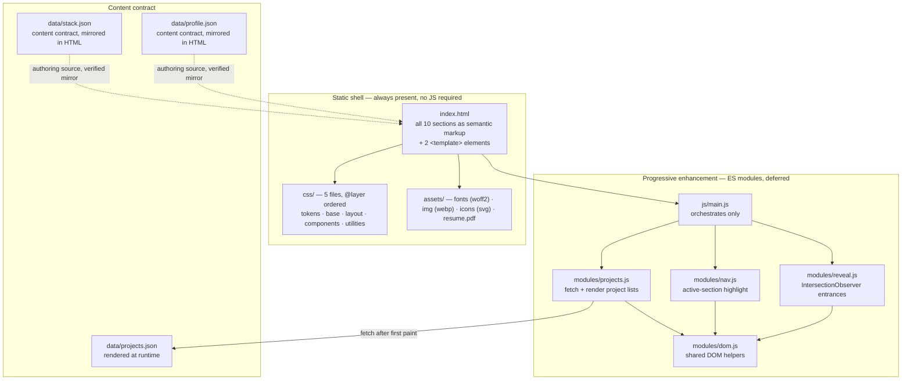
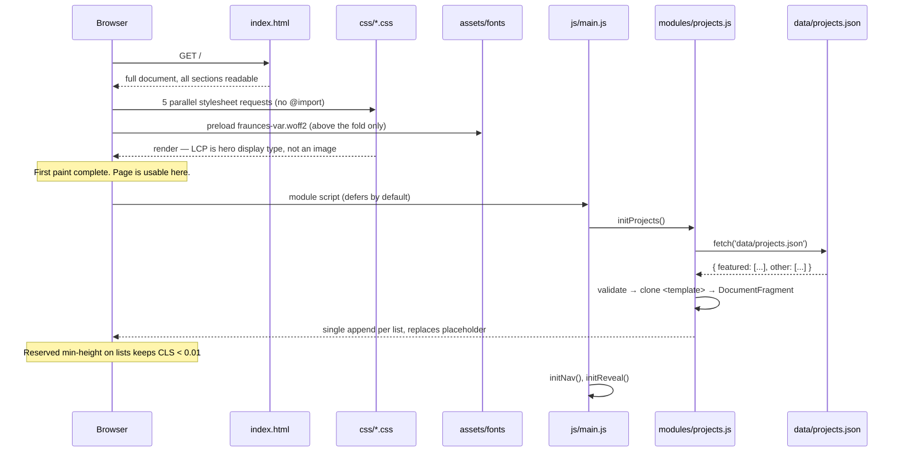

# Design Document: Portfolio Website

## Overview

A single-page, statically hosted personal portfolio that showcases software engineering and AI work
to recruiters, hiring managers, founders, and technical interviewers. It is built with semantic
HTML5, modern CSS (Grid, Flexbox, custom properties, cascade layers), and native ES modules — no
build step, no framework, no runtime dependency, no CDN. Deployment is GitHub Pages serving the
repository files verbatim.

The architecture is deliberately thin. `index.html` carries every section as static, readable markup
so the page is complete with JavaScript disabled. JavaScript is additive only: it renders the two
project lists from `data/projects.json`, highlights the active section in the navigation, and reveals
sections on scroll. CSS handles everything CSS can handle — smooth anchor scrolling, sticky header,
hover and focus states, scroll snapping — so the JavaScript surface stays under roughly 250 lines
across four small modules.

`design.md` at the repository root is the single source of truth for colour, type, spacing, and
component style. Every value used in CSS resolves to a custom property declared in `css/tokens.css`.
Two palette colours do not meet WCAG AA for body-size text, and this document carries that
constraint explicitly into the component and accessibility rules rather than leaving it to be
rediscovered at build time.

---

## Architecture



### Load sequence



### Load-bearing constraints

| Constraint | Consequence in this design |
| --- | --- |
| No build step | Only natively shippable syntax. Module specifiers carry `.js`. Local dev needs `python -m http.server 8000`. |
| No frameworks, no reimplementing one | No router, no virtual DOM, no reactive store, no template engine, no `$()` helper. |
| No npm runtime deps, no CDN | Zero third-party requests. Fonts self-hosted. |
| CSS in exactly 5 files | `@layer tokens, base, layout, components, utilities;` declared once at the top of `tokens.css`. All five linked directly in `<head>`, in that order. **Never** `@import`. |
| Static above-the-fold content | Hero, about, stack, education, contact, resume all in `index.html`. Only project lists render from JSON. |
| No `innerHTML` with JSON data | `<template>` + `cloneNode(true)`, text assigned via `textContent`, URLs via `setAttribute`. |
| Progressive enhancement | JS-disabled page reads fully and the resume downloads. |
| GitHub Pages | Relative paths only, no leading slashes. `.nojekyll` present. `404.html` shares the shell. |

---

## 1. Page architecture

One page. One document. No routing, no partials, no hash-based views. Anchor navigation only.

`<body>` structure:

```
<a class="skip-link" href="#main">      first focusable element
<header class="site-header">            position: sticky, contains <nav>
<main id="main">                        exactly one, tabindex="-1" as focus target
  … 9 sections …
<footer class="site-footer">
<template id="featured-card-template">
<template id="other-item-template">
<script type="module" src="js/main.js">
```

### Section order and anchor ids

Order is canonical per `product.md` and must not change without updating that file.

| # | Section | `id` | Element | Accessible name | Content source | In nav |
| --- | --- | --- | --- | --- | --- | --- |
| 1 | Hero | `hero` | `<section>` | `aria-labelledby="hero-title"` (the single `<h1>`) | static HTML | no (logo links `#main`) |
| 2 | About | `about` | `<section>` | `aria-labelledby="about-title"` | static HTML | yes |
| 3 | Tech stack | `tech-stack` | `<section>` | `aria-labelledby="tech-stack-title"` | static HTML, mirrors `stack.json` | yes |
| 4 | Featured projects | `featured-projects` | `<section>` | `aria-labelledby="featured-projects-title"` | rendered from `projects.json` → `featured` | yes ("Projects") |
| 5 | Other projects | `other-projects` | `<section>` | `aria-labelledby="other-projects-title"` | rendered from `projects.json` → `other` | no (sibling of Projects) |
| 6 | GitHub | `github` | `<section>` | `aria-labelledby="github-title"` | static HTML, link-out only | no |
| 7 | Education | `education` | `<section>` | `aria-labelledby="education-title"` | static HTML, mirrors `profile.json` | yes |
| 8 | Contact | `contact` | `<section>` | `aria-labelledby="contact-title"` | static HTML, mirrors `profile.json` | yes |
| 9 | Resume | `resume` | `<section>` | `aria-labelledby="resume-title"` | static HTML, `<a download>` | no (header CTA points here) |
| 10 | Footer | — | `<footer>` | implicit `contentinfo` | static HTML | no |

Nav is five items: About, Stack, Projects, Education, Contact — plus the accent CTA. Other projects,
GitHub, and Resume are reachable by scrolling and by in-page links from their neighbours; adding them
to the nav would push it past the point where a skimmer parses it in one glance.

### Heading outline

Exactly one `<h1>`. No skipped levels.

```
h1  Hero — name
h2  About / Tech stack / Featured projects / Other projects / GitHub / Education / Contact / Resume
h3    stack group names · featured project titles · other project titles · education degree
```

Section eyebrows ("01 — About") are `<p class="label">` inside the section, not headings, and are
`aria-hidden="true"` when they duplicate the heading's meaning.

### Primary action budget

One accent action per screen, enforced by the single-accent rule:

| Viewport region | The one accent action |
| --- | --- |
| Header (sticky, all scroll positions) | `Resume` CTA → `#resume` |
| Hero | `View projects` → `#featured-projects` |
| Contact | `Email me` → `mailto:` |
| Resume section | `Download resume (PDF)` → `assets/resume.pdf` |

Everything else is a secondary button, a text link with a persistent underline, or plain ink.

---

## Components and Interfaces

*Requested section 2 — Component hierarchy.*

Semantic markup structure per section. Class names are kebab-case BEM-lite. `[data-reveal]` marks a
scroll-reveal target; `[data-*]` hooks are for behaviour, classes are for style.

### Shell

```html
<a class="skip-link" href="#main">Skip to content</a>

<header class="site-header">
  <nav class="site-nav" aria-label="Primary">
    <a class="site-nav__brand" href="#main">Name</a>
    <ul class="site-nav__list" data-nav-list>
      <li><a class="site-nav__link" href="#about">About</a></li>
      <!-- Stack, Projects, Education, Contact -->
    </ul>
    <a class="btn btn--primary site-nav__cta" href="#resume">Resume</a>
  </nav>
</header>

<main id="main" tabindex="-1">…</main>

<footer class="site-footer">
  <p class="site-footer__note">Built with HTML, CSS, and JavaScript. No frameworks.</p>
  <ul class="social-list">…</ul>
  <p class="label">© <time datetime="2026">2026</time></p>
</footer>
```

### Section 1 — Hero

The LCP element is display type, not an image. That costs nothing, fits the editorial system, and
removes the largest source of layout shift.

```html
<section id="hero" class="hero" aria-labelledby="hero-title">
  <p class="label hero__eyebrow">Software engineer · AI</p>
  <h1 id="hero-title" class="hero__title">Full Name</h1>
  <p class="hero__positioning">One line: what I build and for whom.</p>
  <div class="hero__actions">
    <a class="btn btn--primary" href="#featured-projects">View projects</a>
    <a class="btn btn--secondary" href="#contact">Get in touch</a>
  </div>
</section>
```

### Section 2 — About

```html
<section id="about" class="section" aria-labelledby="about-title" data-reveal>
  <p class="label" aria-hidden="true">01 — About</p>
  <h2 id="about-title" class="section__title">About</h2>
  <div class="prose">           <!-- max-inline-size: var(--measure) -->
    <p>…</p><p>…</p>
  </div>
</section>
```

### Section 3 — Tech stack

Lists are `<ul>`. Group names are `<h3>`. Tags are the mono label component.

```html
<section id="tech-stack" class="section" aria-labelledby="tech-stack-title" data-reveal>
  <p class="label" aria-hidden="true">02 — Stack</p>
  <h2 id="tech-stack-title" class="section__title">Tech stack</h2>
  <div class="stack-grid">
    <div class="stack-group">
      <h3 class="stack-group__title">Languages</h3>
      <ul class="tag-list">
        <li class="tag">Python</li>
        <li class="tag">JavaScript</li>
      </ul>
    </div>
    <!-- frontend, backend, ai, tooling -->
  </div>
</section>
```

### Section 4 — Featured projects

The `<ul>` is empty in source except for a `<noscript>` fallback sibling and a placeholder. The
`<template>` lives at the end of `<body>`.

```html
<section id="featured-projects" class="section" aria-labelledby="featured-projects-title">
  <p class="label" aria-hidden="true">03 — Selected work</p>
  <h2 id="featured-projects-title" class="section__title">Featured projects</h2>

  <ul class="project-grid" data-featured-list aria-busy="true">
    <li class="project-grid__placeholder" data-placeholder>Loading projects…</li>
  </ul>

  <p class="project-grid__fallback" data-fallback hidden>
    Project details could not load.
    <a href="https://github.com/USERNAME?tab=repositories">Browse the repositories on GitHub</a>.
  </p>
  <noscript>
    <p>Project details need JavaScript.
      <a href="https://github.com/USERNAME?tab=repositories">Browse the repositories on GitHub</a>.
    </p>
  </noscript>
</section>
```

Featured card template — the structure cloned once per project:

```html
<template id="featured-card-template">
  <li class="project-card" data-reveal>
    <article class="project-card__body" aria-labelledby="">   <!-- id set from project id -->
      
      <p class="label project-card__meta">
        <span data-year></span>
        <span data-status></span>
      </p>
      <h3 class="project-card__title" data-title></h3>        <!-- id="project-{id}-title" -->
      <p class="project-card__tagline" data-tagline></p>
      <p class="project-card__summary" data-summary></p>
      <p class="project-card__role label" data-role></p>
      <ul class="tag-list" data-tech>
        <template data-tech-item><li class="tag"></li></template>
      </ul>
      <ul class="project-card__highlights" data-highlights>
        <template data-highlight-item><li></li></template>
      </ul>
      <ul class="link-list" data-links>
        <template data-link-item><li><a class="link" href=""></a></li></template>
      </ul>
    </article>
  </li>
</template>
```

Nested `<template>` elements give the repeated child rows (tech tags, highlights, links) the same
clone-and-fill treatment as the card itself, so no code path ever concatenates a string into markup.

### Section 5 — Other projects

Compact rows. No images, no highlights, no summary.

```html
<ul class="other-list" data-other-list aria-busy="true"></ul>

<template id="other-item-template">
  <li class="other-item">
    <h3 class="other-item__title" data-title></h3>
    <p class="other-item__tagline" data-tagline></p>
    <p class="label other-item__meta"><span data-year></span></p>
    <ul class="tag-list" data-tech>
      <template data-tech-item><li class="tag"></li></template>
    </ul>
    <ul class="link-list" data-links>
      <template data-link-item><li><a class="link" href=""></a></li></template>
    </ul>
  </li>
</template>
```

### Sections 6–10

```html
<!-- 6. GitHub: link-out only, no API call, no embedded widget -->
<section id="github" class="section" aria-labelledby="github-title" data-reveal>
  <h2 id="github-title" class="section__title">GitHub</h2>
  <p class="prose">Everything I build in the open lives here.</p>
  <a class="btn btn--secondary" href="https://github.com/USERNAME"
     rel="me noopener">github.com/USERNAME</a>
</section>

<!-- 7. Education: definition-style rows in a list, <time> for dates -->
<section id="education" class="section" aria-labelledby="education-title" data-reveal>
  <h2 id="education-title" class="section__title">Education</h2>
  <ul class="education-list">
    <li class="education-item">
      <p class="label"><time datetime="2024">2024</time> — <time datetime="2028">2028</time></p>
      <h3 class="education-item__degree">Degree</h3>
      <p class="education-item__institution">Institution</p>
      <p class="education-item__detail">Relevant coursework or result.</p>
    </li>
  </ul>
</section>

<!-- 8. Contact: real <address>, real mailto, one accent action -->
<section id="contact" class="section" aria-labelledby="contact-title" data-reveal>
  <h2 id="contact-title" class="section__title">Contact</h2>
  <address class="contact">
    <a class="btn btn--primary" href="mailto:name@example.com">Email me</a>
    <ul class="social-list">
      <li><a class="link" href="https://github.com/USERNAME" rel="me">GitHub</a></li>
      <li><a class="link" href="https://linkedin.com/in/USERNAME" rel="me">LinkedIn</a></li>
    </ul>
  </address>
</section>

<!-- 9. Resume: a plain anchor. No JS, no click handler, no blob. -->
<section id="resume" class="section" aria-labelledby="resume-title" data-reveal>
  <h2 id="resume-title" class="section__title">Resume</h2>
  <a class="btn btn--primary" href="assets/resume.pdf" download="Full-Name-Resume.pdf"
     type="application/pdf">
    Download resume <span class="label">PDF · 1 page</span>
  </a>
</section>
```

### Reusable components

| Component | Class | Contract |
| --- | --- | --- |
| Primary button | `.btn--primary` | `--color-tertiary` fill, `--color-on-primary` label at ≥18.66px bold or ≥24px, `--radius-md`, `12px 20px`. One per screen region. |
| Secondary button | `.btn--secondary` | Transparent fill, 1px `--color-secondary` border, ink label. |
| Card | `.project-card` | `--color-surface` on neutral page, `--radius-lg`, `24px` padding, 1px `--color-secondary` hairline. No shadow, no gradient. |
| Label | `.label` | JetBrains Mono, `--text-label`, `--tracking-label`, uppercase. Colour `--color-text-muted`. |
| Tag | `.tag` | Label typography inside a hairline pill. Non-interactive, so it is a `<li>`, not a button. |
| Text link | `.link` | Ink or `--color-accent-text`, always with a persistent underline. Colour is never the only signal. |
| Section | `.section` | `padding-block: var(--space-section)`. No per-section hand-tuning. |
| Container | `.container` | `width: min(100% - 2 * var(--space-lg), var(--container)); margin-inline: auto;` |

---

## 3. Folder structure

Exactly the layout mandated by `structure.md`. No new directories, no nesting inside `css/` or
`js/modules/`.

```
portfolio/
├── index.html                  # the entire site — all 10 sections + 2 <template> elements
├── 404.html                    # same shell and styling, link home
├── .nojekyll                   # empty; stops Jekyll dropping underscore-prefixed paths
├── robots.txt
├── sitemap.xml
├── design.md                   # design system source of truth
├── assets/
│   ├── fonts/
│   │   ├── fraunces-var.woff2        # variable, latin subset — preloaded
│   │   ├── inter-var.woff2           # variable, latin subset — preloaded
│   │   └── jetbrains-mono-400.woff2  # single weight, latin subset
│   ├── img/
│   │   ├── orbit-dashboard-1200w.webp
│   │   ├── orbit-dashboard-2400w.webp
│   │   └── og-portfolio-1200x630.webp
│   ├── icons/                        # inline-able svg, no sprite sheet
│   └── resume.pdf
├── css/
│   ├── tokens.css              # @layer tokens      — declares layer order, custom properties only
│   ├── base.css                # @layer base        — reset, elements, typography, focus, motion guard
│   ├── layout.css              # @layer layout      — shell, header, sections, grids, breakpoints
│   ├── components.css          # @layer components  — btn, card, tag, label, link, lists
│   └── utilities.css           # @layer utilities   — .container, .visually-hidden, .prose, .label
├── js/
│   ├── main.js                 # entry: imports and calls init, nothing else
│   └── modules/
│       ├── projects.js         # fetch + validate + render both project lists
│       ├── nav.js              # active-section highlight
│       ├── reveal.js           # IntersectionObserver entrances
│       └── dom.js              # ~4 shared DOM helpers, no more
└── data/
    ├── projects.json
    ├── stack.json
    └── profile.json
```

### `<head>` contract

Stylesheets are five direct `<link>` elements in layer order. `@import` is a defect here — it
serialises downloads and blocks render.

```html
<meta charset="utf-8">
<meta name="viewport" content="width=device-width, initial-scale=1">   <!-- no maximum-scale -->
<title>Full Name — Software Engineer</title>
<meta name="description" content="…">
<link rel="canonical" href="https://USERNAME.github.io/">

<link rel="preload" href="assets/fonts/fraunces-var.woff2" as="font" type="font/woff2" crossorigin>
<link rel="preload" href="assets/fonts/inter-var.woff2" as="font" type="font/woff2" crossorigin>

<link rel="stylesheet" href="css/tokens.css">
<link rel="stylesheet" href="css/base.css">
<link rel="stylesheet" href="css/layout.css">
<link rel="stylesheet" href="css/components.css">
<link rel="stylesheet" href="css/utilities.css">

<!-- og:title, og:description, og:image, og:url, twitter:card, Person JSON-LD -->
```

Every path is relative with no leading slash. `href="/css/tokens.css"` breaks the moment the site is
served from a project sub-path, which is the single most common way GitHub Pages deployments fail.

### Design decisions and deviations

**D1 — Mobile nav is CSS-only.** `structure.md` describes `nav.js` as "mobile nav, active-section
highlight". A JS overlay would require a focus trap, `Escape` handling, `aria-expanded` state, and
focus restoration: a lot of machinery for five links. Instead the nav list is a single horizontally
scrollable row below `48em` using `overflow-inline: auto` and `scroll-snap-type: inline mandatory`.
No hamburger, no overlay, no trap, no JS. `nav.js` therefore owns one responsibility:
active-section highlighting. If a future redesign genuinely needs an overlay, that is a new module.

**D2 — `stack.json` and `profile.json` are content contracts, not render sources.** The requirement
that above-the-fold and first-impression content live in static HTML conflicts with the rule that all
human-readable copy lives in `data/*.json`. Rendering the stack or the about copy from JSON would put
the first impression behind a fetch and break the JS-disabled path. Rendering nothing from them and
keeping the files would create silent duplication. The resolution: these two files remain the
authoring source of record, `index.html` carries their content as static markup, and the relationship
is enforced as a verifiable invariant (see Correctness Property 25) rather than a
convention. `projects.json` is the only file the browser fetches.

**D3 — No GitHub API.** The GitHub section is a link-out. An API call adds a third-party request,
a rate limit, an unstyled loading state, and a failure mode, in exchange for a contribution graph
nobody hires on. Curation is the point.

---

## Data Models

*Requested section 4 — Data model.*

Two-space indent, no trailing commas, no comments. Optional fields are **omitted**, never `null` or
`""` — renderers test presence, not truthiness of empty values. Never add a field the renderer does
not read; never render a field the schema does not define.

### `data/projects.json`

Top-level shape:

```json
{
  "featured": [ /* 3–4 items */ ],
  "other":    [ /* 4–8 items */ ]
}
```

#### `featured[]`

| Field | Type | Required | Rules |
| --- | --- | --- | --- |
| `id` | string | yes | kebab-case, unique across `featured` **and** `other`, stable. Used to derive DOM ids. |
| `title` | string | yes | Non-empty. The name a human says out loud. |
| `tagline` | string | yes | Non-empty, ≤ 80 chars, one line. |
| `summary` | string | yes | 2–3 sentences: problem, approach, outcome. |
| `role` | string | yes | e.g. `"Solo — design, backend, frontend"`. |
| `year` | number | yes | Integer, 4 digits. Rendered inside `<time datetime>`. |
| `status` | string | yes | One of `shipped` \| `wip` \| `archived`. |
| `tech` | string[] | yes | 3–6 items, canonical spelling, no duplicates. |
| `highlights` | string[] | yes | 2–4 items, each carrying a number or a decision. |
| `links` | object | yes | At least one of `repo`, `demo`, `caseStudy`. Each value an absolute `https://` URL. |
| `image` | object | yes | All four keys present: `src`, `alt`, `width`, `height`. |

`image` sub-schema:

| Key | Type | Rules |
| --- | --- | --- |
| `src` | string | Relative path under `assets/img/`, no leading slash, `.webp`. |
| `alt` | string | Non-empty. Describes what is shown; must not merely repeat `title`. |
| `width` | number | Intrinsic pixel width. Required — missing dimensions is the primary CLS cause. |
| `height` | number | Intrinsic pixel height. |

`links` sub-schema — keys are optional individually, the object must be non-empty:

| Key | Type | Rendered label |
| --- | --- | --- |
| `repo` | string | `View {title} source` |
| `demo` | string | `Open {title} live demo` |
| `caseStudy` | string | `Read the {title} case study` |

Link text is generated from the title so no rendered link ever reads "Click here" or "Link".

#### `other[]`

| Field | Type | Required | Rules |
| --- | --- | --- | --- |
| `id` | string | yes | Same rules as featured; unique across both arrays. |
| `title` | string | yes | Non-empty. |
| `tagline` | string | yes | Non-empty, ≤ 80 chars. |
| `year` | number | yes | Integer. |
| `tech` | string[] | yes | 3–6 items. |
| `links` | object | yes | At least one of `repo`, `demo`, `caseStudy`. |
| `role` | string | no | Optional; omit rather than empty. |
| `status` | string | no | Optional. |
| `summary` / `highlights` / `image` | — | never | Not part of the compact row. Presence is a schema violation. |

### `data/stack.json`

Content contract for the Tech stack section (see D2). Groups are fixed; each entry is a skill the
author would defend in an interview.

```json
{
  "languages": ["Python", "JavaScript", "TypeScript"],
  "frontend":  ["HTML", "CSS", "Web Accessibility"],
  "backend":   ["Node.js", "FastAPI", "PostgreSQL"],
  "ai":        ["PyTorch", "scikit-learn"],
  "tooling":   ["Git", "Docker", "Linux"]
}
```

| Key | Type | Required | Rules |
| --- | --- | --- | --- |
| `languages` | string[] | yes | 3–6 items. |
| `frontend` | string[] | yes | 3–6 items. |
| `backend` | string[] | yes | 3–6 items. |
| `ai` | string[] | yes | 2–6 items. |
| `tooling` | string[] | yes | 3–6 items. |

No group may be empty. Names use canonical spelling (`JavaScript`, `Node.js`, `PostgreSQL`,
`PyTorch`, `scikit-learn`) and must match the spelling used in `projects.json → tech`.

### `data/profile.json`

Content contract for hero, about, education, contact, footer (see D2). Text only — no markup, no
HTML strings, no URLs to fetch.

| Field | Type | Required | Rules |
| --- | --- | --- | --- |
| `name` | string | yes | Rendered as the `<h1>`. |
| `role` | string | yes | Hero eyebrow. |
| `heroLine` | string | yes | One-line positioning, ≤ 120 chars. |
| `about` | string[] | yes | 2–3 paragraphs, first person, past tense, active voice. |
| `education` | object[] | yes | 1–3 entries. |
| `contact` | object | yes | See below. |
| `socials` | object[] | yes | 2–4 entries. |
| `resumePath` | string | yes | `assets/resume.pdf`, relative, no leading slash. |
| `githubUrl` | string | yes | Absolute profile URL. |

`education[]`:

| Key | Type | Required | Rules |
| --- | --- | --- | --- |
| `degree` | string | yes | Rendered as `<h3>`. |
| `institution` | string | yes | |
| `startYear` | number | yes | Integer; becomes `<time datetime>`. |
| `endYear` | number | yes | Integer, `≥ startYear`. Use the expected year for in-progress study. |
| `detail` | string | no | One line: coursework or result. |

`contact`:

| Key | Type | Required | Rules |
| --- | --- | --- | --- |
| `email` | string | yes | Valid address; rendered as `mailto:`. |
| `location` | string | no | City and country only. Never a street address — the repo is public. |

`socials[]`:

| Key | Type | Required | Rules |
| --- | --- | --- | --- |
| `label` | string | yes | Non-empty; becomes the link text. |
| `url` | string | yes | Absolute `https://` URL. |

### What is deliberately absent

No `null` values, no empty strings, no `order`/`index` fields (array order is the order), no
`featured: true` flags (membership in the `featured` array is the flag), no timestamps, no view
counts, no i18n keys. Nothing in `data/` is generated from an API.

---

## 5. Interaction behaviour

The rule is CSS first. JavaScript only where CSS genuinely cannot do the job.

| Behaviour | Owner | Mechanism |
| --- | --- | --- |
| Smooth anchor scrolling | CSS | `html { scroll-behavior: smooth; }` + `scroll-padding-block-start` equal to header height so targets are not hidden under the sticky bar |
| Sticky header | CSS | `position: sticky; inset-block-start: 0` |
| Mobile nav | CSS | Scrollable snapping row below `48em`. No JS (decision D1) |
| Hover / press states | CSS | `:hover`, `:active`, `:focus-visible` |
| Focus ring | CSS | `:focus-visible` — never removed |
| Reduced motion | CSS + JS | Media query guard, plus a JS check before observing |
| Resume download | HTML | `<a href="assets/resume.pdf" download>` — no handler, works with JS off |
| Active-section highlight | JS | `nav.js`, `IntersectionObserver` |
| Scroll reveal | JS | `reveal.js`, `IntersectionObserver`, one-shot |
| Project rendering | JS | `projects.js`, fetch + `<template>` clone |

### 5.1 Navigation

Anchor links only. Every nav item is an `<a href="#section-id">` that works before, during, and after
JavaScript loads. `nav.js` adds nothing to navigation itself — it only reflects position.

Active-section highlight:

- One `IntersectionObserver` watches all nine `<section>` elements with
  `rootMargin: '-45% 0px -45% 0px'`, so a section counts as active when it crosses the viewport's
  vertical middle.
- The matching nav link gets `class="is-active"` and `aria-current="true"`. All others have both
  removed. The visual signal is a solid accent underline plus an ink weight change — never colour
  alone.
- Only sections present in the nav are tracked; entries for untracked sections are ignored rather
  than clearing the current highlight.
- Zero `scroll` listeners. Nothing recalculates offsets on resize.

### 5.2 Scroll reveal

- Targets are marked `[data-reveal]` in HTML. The pre-reveal state
  (`opacity: 0; transform: translateY(var(--space-md))`) lives in CSS but is gated behind a class
  applied by JavaScript, never on `[data-reveal]` alone — see §5.6 for why.
- On intersection at `threshold: 0.15`, add `is-revealed`, then `unobserve` that element. A revealed
  section never animates again, and the observer disconnects once every target has fired.
- Only `transform` and `opacity` animate, at `--duration-base` with `--ease-out`.
- Bail-outs, each applying the final revealed state immediately:
  - `prefers-reduced-motion: reduce` matches
  - `IntersectionObserver` is unavailable
  - a target has already been revealed
- The hero is never a reveal target. Animating the LCP element delays it.
- Cards inserted by `projects.js` carry `[data-reveal]` from the template, so `initReveal()` runs
  after project rendering resolves and picks them up in the same pass.

### 5.3 Project rendering

```mermaid
sequenceDiagram
    participant M as main.js
    participant P as projects.js
    participant N as network
    participant D as DOM

    M->>P: initProjects()
    P->>D: read both list containers + both templates
    alt containers or templates missing
        P-->>M: return silently (nothing to enhance)
    end
    P->>N: fetch('data/projects.json')
    alt response not ok, invalid JSON, or schema violation
        P->>D: remove placeholder, unhide [data-fallback], aria-busy="false"
        P-->>M: fail soft — the rest of the page is untouched
    else success
        P->>P: validateProject() per item; skip and warn on invalid
        loop each valid project
            P->>P: clone template, fill via textContent / setAttribute
        end
        P->>D: replaceChildren(fragment) — one write per list
        P->>D: aria-busy="false"
        P-->>M: resolved
    end
```

Rules the renderer obeys without exception:

- **No `innerHTML`, no `insertAdjacentHTML`, no string concatenation into markup.** Structure comes
  from `<template>` + `cloneNode(true)`; text comes from `textContent`; URLs come from
  `setAttribute`. This holds even though the data is author-written, because the habit is what a
  reviewer reads.
- One `DocumentFragment` per list, one `replaceChildren` call. No per-card reflow.
- Each card's `<article>` gets `aria-labelledby="project-{id}-title"` and the `<h3>` inside gets that
  id, so every card has an accessible name derived from real heading text.
- Link text is composed from the title and link kind (`View Orbit source`), never generic.
- Optional fields absent → the corresponding element is removed from the clone, not left empty. An
  empty `<p>` is a screen-reader speed bump.
- `aria-busy="true"` on both lists in source HTML, set to `"false"` in every terminal path including
  the failure path.
- Reserved vertical space via `min-block-size` on the list containers keeps CLS under target when
  cards land.
- Focus is never moved during render. Insertion happens after first paint but the user may already
  be interacting; stealing focus would be worse than no enhancement.
- Fetch happens once. No retry, no cache layer, no request wrapper.

### 5.4 Resume download

Pure HTML. `<a href="assets/resume.pdf" download="Full-Name-Resume.pdf" type="application/pdf">`
appears in both the sticky header CTA (as an in-page link to `#resume`) and the Resume section (as the
direct file link). No click handler, no `Blob`, no generated object URL. The file size and page count
are stated in the label so the reader knows what they are getting. On iOS Safari `download` is
advisory and the PDF opens inline — that is acceptable and must be verified on a real device.

### 5.5 Failure and empty states

| Condition | Behaviour |
| --- | --- |
| `projects.json` returns non-2xx | Visible fallback paragraph with a GitHub repositories link. Never a silent empty list. |
| `projects.json` is malformed JSON | Same fallback. Error logged once to the console with the file name. |
| A single project fails validation | That project is skipped, a console warning names its `id`, remaining projects still render. |
| `featured` array is empty | Fallback paragraph shown; the section heading stays so the outline is intact. |
| A module throws during init | Caught in `main.js` per module. One broken module never stops the others. |
| JavaScript disabled entirely | `<noscript>` paragraph with the GitHub link. Every other section reads normally and the resume downloads. |

### 5.6 Progressive enhancement — the revealed state is the default

One consequence of the JS-off and script-load-failure paths is load-bearing and easy to get wrong:
**the pre-reveal hidden state must not be a plain CSS rule on `[data-reveal]`.** If
`opacity: 0; transform: translateY(…)` applies unconditionally from the stylesheet, then any path
where the module never runs — scripting disabled, `js/main.js` 404, a syntax error, a blocked
request, an extension stripping modules — leaves every revealed section permanently invisible. A
`@media (scripting: none)` guard does not cover this, because scripting *is* enabled in the
script-load-failure case.

The resolution: the revealed state is the CSS default, and JavaScript opts each target into the
pre-reveal state. `initReveal` adds `is-prereveal` to a target in the same synchronous pass in which
it observes that target, and the pre-reveal declarations are scoped to
`[data-reveal].is-prereveal:not(.is-revealed)`. Intersection then adds `is-revealed` exactly as
§5.2 describes. Equivalently, a class set on `<html>` by the module may gate the same rule; what is
forbidden is a scripting-absent media guard as the only protection.

Consequences: with no script execution every `[data-reveal]` element renders at full opacity and its
untranslated position, and a target is never hidden by CSS alone at any point. The cost is a possible
brief flash of the final state before the deferred module runs. That trade is correct — a flash of
readable content beats a section that never appears.

---

## 6. Accessibility requirements

Target: **WCAG 2.1 AA**. These are acceptance criteria, not aspirations. On a portfolio read by
engineers, an inaccessible page is a visible technical failure.

### 6.1 Contrast — the verified constraint

Two palette colours do not pass for body-size text. This is already measured, and the design works
around it rather than re-litigating it:

| Pair | Ratio | Verdict | Where it may be used |
| --- | --- | --- | --- |
| `--color-primary` #131210 on neutral | 16.5:1 | pass | anything |
| `--color-secondary` #716E68 on neutral | **4.46:1** | **fails normal text** | borders, hairlines, rules, icons **only** |
| `--color-tertiary` #E6552F on white | **3.68:1** | **fails normal text** | fills, underlines, focus rings, display text ≥24px |
| `--color-tertiary` #E6552F on neutral | **3.24:1** | **fails normal text** | as above; clears the 3:1 non-text threshold for focus rings |
| `--color-text-muted` #5F5C57 on neutral | 4.54:1 | pass | all muted body text, captions, metadata, labels |
| `--color-accent-text` #C0431C on neutral | 4.54:1 | pass | accent-coloured body text and links |

Binding rules:

1. `--color-secondary` **never** styles text. Muted copy, captions, metadata, and `.label` use
   `--color-text-muted`.
2. `--color-tertiary` **never** styles body-size text. Accent-coloured text at body size uses
   `--color-accent-text`.
3. `--color-tertiary` as a *fill* is fine; white text on that fill is only permitted at ≥18.66px bold
   or ≥24px regular, which is why the primary button label is set at the bold/large threshold rather
   than at `--text-body`.
4. Colour is never the only signal. Links carry a persistent underline. The active nav item carries
   an underline and a weight change. Project status is a word (`shipped`, `wip`, `archived`), not a
   coloured dot.
5. Any new colour pairing is measured before it ships. `--color-text-muted` and
   `--color-accent-text` are derived values, not from `design.md`, and their exact hex must be
   confirmed against the palette when tokens are written.

### 6.2 Semantics

- One `<h1>` (the name in the hero). Headings descend without skipping.
- Landmarks: one `<header>`, one `<nav aria-label="Primary">`, one `<main>`, one `<footer>`.
- Every `<section>` has an accessible name via `aria-labelledby` pointing at its own heading.
- `<a>` navigates, `<button>` acts. No `<div>` with a click handler anywhere in this design.
- Lists are lists: projects, tech tags, highlights, socials, education entries all `<ul>`.
- `<time datetime="YYYY">` for years, `<address>` for contact details, `rel="me"` on identity links.
- ARIA is used in exactly four places: `aria-labelledby` on sections and cards, `aria-current` on the
  active nav link, `aria-busy` on the two project lists, `aria-hidden` on decorative eyebrows and
  decorative SVG. Anything more means the wrong element was chosen.

### 6.3 Keyboard paths

Tab order equals visual order throughout. No positive `tabindex`. `tabindex="-1"` appears only on
`<main>` as the skip-link target.

Path A — first-pass skim:
`skip link → brand → About → Stack → Projects → Education → Contact → Resume CTA → hero primary →
hero secondary → …`

Path B — skip to content: `Tab` (skip link) → `Enter` → focus lands on `<main id="main">` → next
`Tab` enters the hero actions. The skip link is the first focusable element, visually hidden until
focused, and fully visible when focused (not clipped by the sticky header).

Path C — a featured card: `card link 1 (repo) → card link 2 (demo) → next card`. The card itself is
not focusable; there is no whole-card click target, so there is no keyboard-trap-shaped hole where a
mouse user has an affordance a keyboard user does not.

Path D — resume with JS off: `skip link → brand → nav → … → Resume section download link → Enter →
file downloads`. Verified as part of the JS-disabled pass.

Focus management:

```css
:focus-visible {
  outline: 2px solid var(--color-tertiary);
  outline-offset: 3px;
  border-radius: var(--radius-sm);
}
```

- Focus styles are never removed. `outline: none` without a replacement is a defect.
- The accent ring at 3.24:1 against neutral clears the 3:1 non-text contrast requirement.
- `scroll-padding-block-start` on `html` prevents an anchor target — and its focused child — from
  landing under the sticky header.
- No JavaScript moves focus. There is no modal, no overlay, no toast. Rendering project cards must
  not disturb the focused element.

### 6.4 Reduced motion

```css
@media (prefers-reduced-motion: reduce) {
  *, *::before, *::after {
    animation-duration: 0.01ms !important;
    animation-iteration-count: 1 !important;
    transition-duration: 0.01ms !important;
    scroll-behavior: auto !important;
  }
}
```

`reveal.js` additionally checks `matchMedia('(prefers-reduced-motion: reduce)').matches` before
observing anything and applies `is-revealed` to every target immediately. The CSS guard alone would
still leave content mid-transition if the observer never fired.

### 6.5 Text, zoom, and media

- Body line height 1.65 (`--leading-body`), above the 1.5 minimum. Line length capped at `--measure`
  (68ch).
- No `maximum-scale` or `user-scalable=no` in the viewport meta. No `user-select: none` on copy.
- Layout survives 200% zoom and a 320px viewport with no clipping or overlap. This is why every
  display size is a `clamp()` — `design.md` specifies 5rem, which overflows a 375px viewport
  unscaled.
- Every `` has `alt`: descriptive for project shots, `alt=""` for decoration. Decorative inline
  SVG gets `aria-hidden="true"` and `focusable="false"`; meaningful SVG gets `role="img"` and a
  `<title>`.
- Dynamically rendered cards meet the same bar as static markup: real `<h3>` headings, real links
  with meaningful text, a visible message on failure.

### 6.6 Verification

1. Tab the entire page. Every stop visible, in order, nothing skipped, nothing trapped.
2. Load with JavaScript disabled. Page reads; resume downloads.
3. Zoom to 200% and narrow to 320px. Nothing clips or overlaps.
4. Lighthouse accessibility: expect 100.
5. Automated checks cover roughly a third of WCAG. The manual keyboard pass is not optional, and
   full conformance also requires screen reader testing and expert review. Claiming AA compliance
   from a Lighthouse score alone would be dishonest and this document does not do that.

---

## 7. Responsive behaviour

Mobile-first. Base styles target the smallest viewport (320px minimum). Every media query is
`min-width` in `em`. Four breakpoints exist and no others are invented:

| Token | `em` | ≈ px | Role |
| --- | --- | --- | --- |
| `sm` | `40em` | 640 | large phone / small tablet portrait |
| `md` | `48em` | 768 | tablet — nav becomes a static row, grids go two-up |
| `lg` | `64em` | 1024 | laptop — editorial two-column asymmetry appears |
| `xl` | `80em` | 1280 | wide — container caps at `--container` (1200px) |

Intrinsic layout is preferred over breakpoints wherever it works:

```css
.project-grid {
  display: grid;
  gap: var(--space-lg);
  grid-template-columns: repeat(auto-fit, minmax(min(320px, 100%), 1fr));
}
```

Container queries are used where a component's layout depends on its own box rather than the
viewport — the project card's image/text arrangement is the one place that applies.

### Per-section layout shifts

| Section | base (<40em) | `40em` | `48em` | `64em` | `80em` |
| --- | --- | --- | --- | --- | --- |
| Header / nav | sticky; brand + scroll-snapping link row; CTA pinned inline-end | — | link row stops scrolling, sits inline with brand; CTA inline-end | — | container caps |
| Hero | 1 col, `--text-display` at clamp lower bound (2.75rem); actions stack full-width | actions become an inline row | — | display reaches upper bound (5rem); eyebrow moves to a left rail | container caps, extra `--space-2xl` block padding |
| About | 1 col, `.prose` at `--measure` | — | — | 2 col: sticky `<h2>` in col 1, prose in col 2 | — |
| Tech stack | 1 col, groups stacked | 2 col `auto-fit` | — | 3 col; tag rows wrap with `gap` | — |
| Featured projects | 1 col cards, image above text, `aspect-ratio: 16/10` | — | 2 col `auto-fit` from `minmax(320px, 1fr)` | first card spans both columns (`.project-card--wide`), image beside text via container query | container caps; gap grows to `--space-xl` |
| Other projects | stacked rows, hairline between | — | 2 col | 2 col with year in a left rail | — |
| GitHub | 1 col, centred | — | text and button inline | — | — |
| Education | stacked; year label above degree | — | 2 col grid: year rail + detail | — | — |
| Contact | stacked; email button full-width | button shrinks to content | email and socials inline | — | — |
| Resume | stacked, full-width button | button shrinks to content | — | — | — |
| Footer | stacked, centred | — | 3 col: note, socials, copyright | — | — |

### Fluid type

`clamp()` is required, not optional. `design.md` specifies display at 5rem, which overflows a 375px
viewport unscaled. Each clamp's **upper bound matches `design.md` exactly**:

| Token | Value | `design.md` size |
| --- | --- | --- |
| `--text-display` | `clamp(2.75rem, 9vw, 5rem)` | 5rem |
| `--text-h1` | `clamp(2rem, 5vw, 2.5rem)` | 2.5rem (h1) |
| `--text-h2` | `clamp(1.5rem, 3.5vw, 1.875rem)` | derived on the same rhythm |
| `--text-h3` | `1.25rem` | fixed, no fluid range needed |
| `--text-body` | `0.98rem` | 0.98rem |
| `--text-label` | `0.72rem` | 0.72rem |
| `--space-section` | `clamp(var(--space-xl), 10vw, 160px)` | rhythm extension of `lg` |

The display token's lower bound (2.75rem ≈ 44px) is chosen so the longest expected name fits a 320px
viewport without a horizontal scrollbar. Verify with the actual name before locking the value.

### Layout mechanics

- Grid for two-dimensional structure: page shell, project grids, education rows, footer.
- Flexbox for one-dimensional runs: nav, button groups, tag lists, social lists.
- No floats. No absolute positioning for layout — absolute is for genuine overlays, of which there
  are none.
- `gap` between siblings, not margins on children.
- Logical properties throughout: `margin-inline`, `padding-block`, `inset-inline-start`.
- Vertical rhythm from `--space-section` on `.section` padding. No per-section hand-tuning.

---

## Low-level design

Language is JavaScript (ES2020+, native modules) as specified in the request. Named exports only, no
default exports, no classes, `const` by default. Every module exports one `init` function, guards its
entry point, and keeps internals private.

### Core types

Documented with JSDoc because there is no TypeScript and no build step to strip annotations.

```js
/**
 * @typedef {Object} ProjectImage
 * @property {string} src     relative path, no leading slash
 * @property {string} alt     non-empty, describes the screenshot
 * @property {number} width   intrinsic px
 * @property {number} height  intrinsic px
 */

/**
 * @typedef {Object} ProjectLinks
 * @property {string} [repo]
 * @property {string} [demo]
 * @property {string} [caseStudy]
 */

/**
 * @typedef {Object} Project
 * @property {string}       id
 * @property {string}       title
 * @property {string}       tagline
 * @property {number}       year
 * @property {string[]}     tech
 * @property {ProjectLinks} links
 * @property {string}       [summary]      featured only
 * @property {string}       [role]
 * @property {'shipped'|'wip'|'archived'} [status]
 * @property {string[]}     [highlights]   featured only
 * @property {ProjectImage} [image]        featured only
 */

/**
 * @typedef {Object} ProjectData
 * @property {Project[]} featured
 * @property {Project[]} other
 */

/** @typedef {'featured'|'other'} ProjectKind */
```

### Module surface

```js
// js/main.js — orchestration only, no logic
import { initProjects } from './modules/projects.js';
import { initNav }      from './modules/nav.js';
import { initReveal }   from './modules/reveal.js';

// js/modules/projects.js
export async function initProjects(): Promise<void>

// js/modules/nav.js
export function initNav(): void

// js/modules/reveal.js
export function initReveal(root?: ParentNode): void

// js/modules/dom.js — four helpers, and it stops there
export function qs(selector, scope = document): Element | null
export function qsa(selector, scope = document): Element[]
export function fillText(scope, hook, value): boolean   // textContent, removes node if value absent
export function cloneTemplate(templateEl): DocumentFragment
```

### Key functions with formal specifications

#### `loadProjects()`

```js
/** @returns {Promise<ProjectData>} */
async function loadProjects()
```

**Preconditions:** the page was served over `http(s)` (not `file://`); `data/projects.json` is
addressed by a relative path with no leading slash.

**Postconditions:** resolves to a parsed object, or rejects with an `Error` whose message names the
file and the HTTP status. Performs exactly one network request per page load. No caching layer, no
retry, no request wrapper. Never mutates global state.

**Loop invariants:** none — no loops.

#### `validateProject(project, kind)`

```js
/**
 * @param {unknown} project
 * @param {ProjectKind} kind
 * @returns {boolean}
 */
function validateProject(project, kind)
```

**Preconditions:** `project` may be any value including `null` or `undefined`; `kind` is a valid
`ProjectKind`.

**Postconditions:** returns `true` if and only if `project` satisfies every required-field rule for
`kind` (§4) — required keys present, strings non-empty after trim, `year` an integer, `tech` a
non-empty array of non-empty strings, `links` containing at least one of `repo`/`demo`/`caseStudy`
with absolute `https://` values, and for `kind === 'featured'` an `image` with non-empty `alt` and
positive integer `width`/`height`. Pure: no DOM access, no mutation of `project`, no exception thrown
for any input.

**Loop invariants:** while iterating required keys, every key checked so far was present and
well-typed; the first failure returns `false` immediately.

#### `renderCard(project, template, kind)`

```js
/**
 * @param {Project} project      already validated
 * @param {HTMLTemplateElement} template
 * @param {ProjectKind} kind
 * @returns {DocumentFragment}
 */
function renderCard(project, template, kind)
```

**Preconditions:** `validateProject(project, kind) === true`; `template` is an
`HTMLTemplateElement` present in the document containing the hooks listed in §2.

**Postconditions:** returns a detached fragment containing exactly one root list item. All text is set
via `textContent`; all URLs via `setAttribute`. The element count of the returned fragment is
independent of the *content* of any string field — it depends only on which optional fields are
present. `innerHTML` is never assigned. Hooks whose value is absent are removed from the clone. The
card's labelling element references an `<h3>` with id `project-{project.id}-title` and non-empty text.
No node is inserted into the live document.

**Loop invariants:** for the `tech`, `highlights`, and `links` loops — after k iterations the target
`<ul>` holds exactly k `<li>` children, each with non-empty text, and for `links` each `<li>` holds
one `<a>` with a non-empty `href`.

#### `renderList(container, items, template, kind)`

```js
/**
 * @param {Element} container
 * @param {unknown[]} items
 * @param {HTMLTemplateElement} template
 * @param {ProjectKind} kind
 * @returns {number} count of cards rendered
 */
function renderList(container, items, template, kind)
```

**Preconditions:** `container` is in the document and carries `aria-busy="true"`; `items` is any
array-like or non-array value.

**Postconditions:** returns n, the number of valid items. `container` has exactly n element children
and `aria-busy="false"`. Exactly one write to the live DOM occurs (`replaceChildren`), so the function
is idempotent — calling it again with the same input yields the same n children, not 2n. Invalid items
are skipped with one console warning each. `document.activeElement` is unchanged. If n = 0 the caller
is responsible for revealing the fallback.

**Loop invariants:** the fragment holds exactly one card per valid item processed so far; the live DOM
is untouched until the loop completes.

#### `initNav()`

```js
/** @returns {void} */
function initNav()
```

**Preconditions:** none. Returns silently if `[data-nav-list]` is absent, if it contains no anchors,
or if `IntersectionObserver` is unavailable.

**Postconditions:** at most one nav link carries `is-active` and `aria-current="true"` at any time.
Zero `scroll` or `resize` listeners are registered. Navigation itself is unaffected: removing this
module leaves every anchor working.

**Loop invariants:** while processing an observer callback batch, at most one link is marked active;
marking a new link clears the previous one before setting the new one.

#### `initReveal(root)`

```js
/**
 * @param {ParentNode} [root=document]
 * @returns {void}
 */
function initReveal(root = document)
```

**Preconditions:** none. Returns silently if no `[data-reveal]` targets exist under `root`.

**Postconditions:** if `prefers-reduced-motion: reduce` matches or `IntersectionObserver` is missing,
every target has `is-revealed` before the function returns and no observer is created. Otherwise each
target receives `is-revealed` at most once and is unobserved immediately after; the observer is
disconnected when the last target has fired. No timers remain. Only `transform` and `opacity` are
animated, and only via CSS classes — never inline `style`.

**Loop invariants:** every target processed so far is either revealed or under observation, never
both and never neither.

### Algorithmic pseudocode

```pascal
ALGORITHM initProjects()
INPUT:  none (reads the document and data/projects.json)
OUTPUT: none (mutates two list containers)

BEGIN
  featuredList  ← query('[data-featured-list]')
  otherList     ← query('[data-other-list]')
  featuredTpl   ← query('#featured-card-template')
  otherTpl      ← query('#other-item-template')
  fallback      ← query('[data-fallback]')

  // Nothing to enhance is a success, not an error.
  IF featuredList = NULL OR featuredTpl = NULL THEN
    RETURN
  END IF

  TRY
    data ← await loadProjects()
  CATCH error
    logOnce(error)
    showFallback(featuredList, otherList, fallback)
    RETURN
  END TRY

  ASSERT data IS object

  featuredCount ← renderList(featuredList, data.featured, featuredTpl, 'featured')
  otherCount    ← renderList(otherList,    data.other,    otherTpl,    'other')

  IF featuredCount = 0 THEN
    showFallback(featuredList, otherList, fallback)
  END IF

  ASSERT featuredList.getAttribute('aria-busy') = 'false'
END
```

**Preconditions:** DOM is parsed (module scripts defer, so this holds). Static content has already
painted.
**Postconditions:** both lists have `aria-busy="false"`; either cards are present or a visible
fallback is. The rest of the page is unaffected in every path.
**Loop invariants:** none directly; delegated to `renderList`.

```pascal
ALGORITHM renderList(container, items, template, kind)
INPUT:  container: Element, items: any, template: HTMLTemplateElement, kind: ProjectKind
OUTPUT: rendered: Integer

BEGIN
  IF container = NULL THEN RETURN 0 END IF

  IF NOT isArray(items) THEN
    container.setAttribute('aria-busy', 'false')
    RETURN 0
  END IF

  fragment ← createDocumentFragment()
  rendered ← 0

  FOR each item IN items DO
    // INVARIANT: fragment holds exactly `rendered` cards,
    //            each with a non-empty heading and >= 1 valid link.
    ASSERT elementChildCount(fragment) = rendered

    IF NOT validateProject(item, kind) THEN
      warn('skipping invalid project', item?.id ?? '<no id>')
      CONTINUE
    END IF

    fragment.append(renderCard(item, template, kind))
    rendered ← rendered + 1
  END FOR

  // Single live-DOM write keeps this idempotent and reflow-cheap.
  container.replaceChildren(fragment)
  container.setAttribute('aria-busy', 'false')

  ASSERT elementChildCount(container) = rendered
  RETURN rendered
END
```

**Preconditions:** `template` contains the documented hooks.
**Postconditions:** container child count equals the return value; exactly one live DOM write;
`aria-busy` cleared on every path; focus untouched.
**Loop invariants:** stated inline — the fragment's element count always equals `rendered`, and the
live DOM stays untouched until the loop ends.

```pascal
ALGORITHM renderCard(project, template, kind)
INPUT:  project: Project (validated), template: HTMLTemplateElement, kind: ProjectKind
OUTPUT: fragment: DocumentFragment

BEGIN
  ASSERT validateProject(project, kind) = TRUE

  fragment ← template.content.cloneNode(TRUE)
  card     ← fragment.firstElementChild
  titleId  ← 'project-' + project.id + '-title'

  // Accessible name comes from real heading text, not an aria-label string.
  setText(fragment, '[data-title]', project.title)
  setId(fragment,   '[data-title]', titleId)
  setAttr(card, 'aria-labelledby', titleId)      // on the inner <article> for featured

  setText(fragment, '[data-tagline]', project.tagline)
  setTime(fragment, '[data-year]', project.year) // <time datetime="YYYY">

  // Optional fields: remove the node rather than leaving it empty.
  FOR each (hook, value) IN [('[data-summary]', project.summary),
                             ('[data-role]',    project.role),
                             ('[data-status]',  project.status)] DO
    IF value IS PRESENT THEN
      setText(fragment, hook, value)
    ELSE
      removeNode(fragment, hook)
    END IF
  END FOR

  IF kind = 'featured' THEN
    img ← query(fragment, '[data-image]')
    setAttr(img, 'src',    project.image.src)
    setAttr(img, 'alt',    project.image.alt)
    setAttr(img, 'width',  project.image.width)
    setAttr(img, 'height', project.image.height)
    // width/height are set before insertion so the box is reserved on first layout.
    ASSERT img.getAttribute('alt') ≠ ''
  END IF

  appendItems(fragment, '[data-tech]',       project.tech)
  appendItems(fragment, '[data-highlights]', project.highlights ?? [])
  appendLinks(fragment, '[data-links]',      project.links, project.title)

  ASSERT NOT usedInnerHTML          // structural rule, enforced by review and Property 11
  RETURN fragment
END


ALGORITHM appendLinks(scope, hook, links, title)
INPUT:  scope: DocumentFragment, hook: String, links: ProjectLinks, title: String
OUTPUT: none

BEGIN
  list     ← query(scope, hook)
  itemTpl  ← query(list, 'template[data-link-item]')
  labels   ← { repo:      'View ' + title + ' source',
               demo:      'Open ' + title + ' live demo',
               caseStudy: 'Read the ' + title + ' case study' }
  count    ← 0

  FOR each kind IN ['repo', 'demo', 'caseStudy'] DO
    // INVARIANT: list holds exactly `count` <li>, each with one <a>
    //            having a non-empty href and non-empty, meaningful text.
    ASSERT liCount(list) = count

    IF links[kind] IS PRESENT THEN
      row ← itemTpl.content.cloneNode(TRUE)
      a   ← query(row, 'a')
      a.setAttribute('href', links[kind])
      a.textContent ← labels[kind]
      IF isExternal(links[kind]) THEN
        a.setAttribute('rel', 'noopener')
      END IF
      list.append(row)
      count ← count + 1
    END IF
  END FOR

  removeNode(list, 'template[data-link-item]')   // templates are inert but keep the DOM clean
  ASSERT count ≥ 1                                // guaranteed by validateProject
END
```

```pascal
ALGORITHM initReveal(root)
INPUT:  root: ParentNode
OUTPUT: none

BEGIN
  targets ← queryAll(root, '[data-reveal]')
  IF isEmpty(targets) THEN RETURN END IF

  reduced ← matchMedia('(prefers-reduced-motion: reduce)').matches

  // The CSS guard alone would leave content stuck mid-transition
  // if the observer never fired, so JS applies the end state directly.
  IF reduced OR NOT supports('IntersectionObserver') THEN
    FOR each el IN targets DO
      el.classList.add('is-revealed')
    END FOR
    RETURN
  END IF

  remaining ← count(targets)
  observer  ← new IntersectionObserver(onEntries, { threshold: 0.15 })

  FOR each el IN targets DO
    observer.observe(el)
  END FOR

  PROCEDURE onEntries(entries)
  BEGIN
    FOR each entry IN entries DO
      // INVARIANT: every target is either revealed-and-unobserved, or observed. Never both.
      IF entry.isIntersecting THEN
        entry.target.classList.add('is-revealed')
        observer.unobserve(entry.target)      // one-shot: never re-animate
        remaining ← remaining - 1
      END IF
    END FOR
    IF remaining = 0 THEN
      observer.disconnect()                    // leave nothing attached
    END IF
  END PROCEDURE
END


ALGORITHM initNav()
INPUT:  none
OUTPUT: none

BEGIN
  links ← queryAll('[data-nav-list] a[href^="#"]')
  IF isEmpty(links) OR NOT supports('IntersectionObserver') THEN RETURN END IF

  byId    ← map from link.hash.slice(1) → link
  current ← NULL

  // -45%/-45% makes "active" mean "crossing the vertical middle of the viewport",
  // which matches what a reader perceives far better than top-edge detection.
  observer ← new IntersectionObserver(onEntries,
               { rootMargin: '-45% 0px -45% 0px', threshold: 0 })

  FOR each id IN keys(byId) DO
    section ← queryById(id)
    IF section ≠ NULL THEN observer.observe(section) END IF
  END FOR

  PROCEDURE onEntries(entries)
  BEGIN
    FOR each entry IN entries DO
      IF NOT entry.isIntersecting THEN CONTINUE END IF

      next ← byId[entry.target.id]
      IF next = NULL OR next = current THEN CONTINUE END IF

      // INVARIANT: at most one link is active at any point.
      IF current ≠ NULL THEN
        current.classList.remove('is-active')
        current.removeAttribute('aria-current')
      END IF
      next.classList.add('is-active')
      next.setAttribute('aria-current', 'true')
      current ← next

      ASSERT countActive(links) = 1
    END FOR
  END PROCEDURE
END
```

### Example usage

```js
// js/main.js — orchestrates, never implements.
// Each init is isolated: one failing module must not take the page down.
import { initProjects } from './modules/projects.js';
import { initNav } from './modules/nav.js';
import { initReveal } from './modules/reveal.js';

try {
  initNav();
} catch (error) {
  console.warn('nav: skipped', error);
}

// Reveal runs twice by design: once for static sections, once for the
// cards that projects.js inserts. Both passes are one-shot per element.
try {
  initReveal();
} catch (error) {
  console.warn('reveal: skipped', error);
}

initProjects()
  .then(() => initReveal(document.querySelector('[data-featured-list]')))
  .catch((error) => console.warn('projects: skipped', error));
```

```js
// js/modules/dom.js — the whole file. If it grows past this, it is becoming a framework.
export const qs = (selector, scope = document) => scope.querySelector(selector);

export const qsa = (selector, scope = document) => [...scope.querySelectorAll(selector)];

export function cloneTemplate(templateEl) {
  return templateEl.content.cloneNode(true);
}

/** Sets text, or removes the node when the value is absent. Returns whether text was set. */
export function fillText(scope, hook, value) {
  const node = qs(hook, scope);
  if (!node) return false;
  if (value === undefined || value === null || value === '') {
    node.remove();
    return false;
  }
  node.textContent = String(value);   // never innerHTML
  return true;
}
```

```js
// A hostile-looking title stays inert text. This is the point of textContent.
const project = {
  id: 'orbit',
  title: '',
  tagline: 'Real-time telemetry for edge fleets.',
  year: 2026,
  tech: ['Python', 'FastAPI', 'WebSockets'],
  links: { repo: 'https://github.com/USERNAME/orbit' },
};

const fragment = renderCard(project, otherTemplate, 'other');
// fragment.querySelectorAll('img').length === 0
// fragment.querySelector('[data-title]').textContent === ''
```

---

## Correctness Properties

*A property is a characteristic or behavior that should hold true across all valid executions of a
system — essentially, a formal statement about what the system should do. Properties serve as the
bridge between human-readable specifications and machine-verifiable correctness guarantees.*

These are the invariants worth checking mechanically, written as universally quantified statements
over the data and the rendered DOM so each maps directly onto a property-based test: generate valid
and invalid `projects.json` documents, run the real renderer against a jsdom document seeded with the
shipped `index.html`, and assert. Properties 1–6, 25, and 26 need no DOM and run against generated
JSON alone. Every property carries the acceptance criteria it validates; criteria that are better
served by an example, a smoke check, or a manual pass are listed in the verification table at the end
of this section.

### Schema and data properties

### Property 1: Project data schema conformance

*For any* `projects.json` document, every entry in `featured` carries a value for each required
featured field with every string non-empty after trimming, every entry in `other` carries a value for
each required compact field and omits `summary`, `highlights`, and `image`, no present value is
`null`, `""`, `[]`, or `{}`, and every entry's `links` object holds at least one of `repo`, `demo`,
`caseStudy` with each present value an absolute `https://` URL. Every object key in the document is
camelCase matching `^[a-z][a-zA-Z0-9]*$` and appears at most once within its object.

**Validates: Requirements 3.1, 3.2, 3.3, 3.5, 3.7, 3.11**

### Property 2: Featured images are complete and descriptive

*For any* entry in `featured`, `image` exists with all four keys, `image.alt` is non-empty and not
equal to `title`, `image.width` and `image.height` are positive integers, and `image.src` carries no
leading `/`.

**Validates: Requirements 3.6**

### Property 3: Project ids are unique and well formed

*For all* pairs of distinct entries drawn from `featured ∪ other`, their `id` values differ, and *for
any* entry the `id` matches `^[a-z0-9]+(-[a-z0-9]+)*$`.

**Validates: Requirements 3.4**

### Property 4: Curation bounds and closed enumerations hold

*For any* `projects.json` document: 3 ≤ |featured| ≤ 4, 4 ≤ |other| ≤ 8, and *for any* entry
3 ≤ |tech| ≤ 6 with no duplicate entries, |tagline| ≤ 80, `year` is an integer in
[2000, currentYear + 1] with currentYear + 1 permitted only when `status` = `wip`, any present
`status` ∈ {`shipped`, `wip`, `archived`}, and *for any* featured entry 2 ≤ |highlights| ≤ 4 with each
highlight 20–120 characters and at least one highlight per entry containing a numeric measurement.

**Validates: Requirements 3.8, 3.9, 3.13**

### Property 5: The validator agrees with the schema

*For any* generated schema-conformant project of either kind, `validateProject` returns `true`; and
*for any* single-rule mutation of such a project — a required key removed, a string emptied, a year
made non-integer, a link scheme changed, an `other`-only entry given `summary`, `highlights`, or
`image` — `validateProject` returns `false`.

**Validates: Requirements 5.8**

### Property 6: The validator is total and pure

*For any* value whatsoever, including `null`, `undefined`, primitives, arrays, and deeply nested
objects, `validateProject` returns a boolean without throwing, without touching the DOM, and without
mutating its argument.

**Validates: Requirements 5.7**

### Rendering properties

### Property 7: One card per project, and rendering is idempotent

*For any* valid `projects.json` document, after rendering
count(`[data-featured-list] > li.project-card`) = |featured| and
count(`[data-other-list] > li.other-item`) = |other| with no additional element children; and
rendering the same document a second time leaves both counts unchanged rather than doubled. Within
each card, count(`[data-tech] > li`) = |tech| ≤ 6, count(`[data-highlights] > li`) = |highlights| ≤ 4,
and count(`[data-links] > li`) = |present link keys| ≤ 3.

**Validates: Requirements 4.2, 4.11, 4.13**

### Property 8: Absent optional fields leave no empty element

*For any* valid project and *for any* subset of its optional fields (`summary`, `role`, `status`,
`highlights`), the rendered card contains a hook element for exactly the fields that are present, and
no rendered element inside the card has empty or whitespace-only text content.

**Validates: Requirements 4.5**

### Property 9: Accessible names come from real headings

*For any* valid `projects.json` document, after rendering every card's labelling element resolves its
`aria-labelledby` to an `<h3>` inside that card with id `project-{id}-title` and non-empty text, and
every `<section>` resolves its `aria-labelledby` to a heading inside itself with non-empty text.

**Validates: Requirements 4.6, 9.2**

### Property 10: Rendered links are meaningful, addressable, and safe

*For any* valid project, every rendered `<a>` has an `href` that is a non-empty string other than
`"#"`, has text equal to the label composed from the project title and link kind (`View {title}
source`, `Open {title} live demo`, `Read the {title} case study`) and therefore never one of
{`Link`, `Click here`, `Here`, `Read more`}, and carries `rel` containing `noopener` when its `href`
is external.

**Validates: Requirements 4.7, 4.8, 16.4**

### Property 11: Text is never interpreted as markup

*For any* project whose string fields contain `<`, `>`, `&`, or quote characters, the rendered card
contains each string as a text node whose `textContent` equals the input exactly, and the card's
element-node count equals the element-node count of an unfilled clone of the same template. A
generated title of `` produces zero additional elements.

**Validates: Requirements 16.2**

### Property 12: Rendered URLs are https-only

*For any* `links` object containing values with hostile or unsupported schemes (`javascript:`,
`data:`, `http:`, protocol-relative, or relative), the renderer either rejects the project through
validation or renders no `href` carrying that value, so every `href` present in a rendered card is an
absolute `https://` URL.

**Validates: Requirements 16.3, 16.7**

### Property 13: Ids are unique in the rendered document

*For any* valid `projects.json` document, after rendering no two elements in the document share an
`id` value.

**Validates: Requirements 4.12**

### Property 14: The heading outline survives rendering

*For any* valid `projects.json` document, after rendering the document contains exactly one `<h1>`,
and walking headings in document order never increases the level by more than one step.

**Validates: Requirements 1.4**

### Property 15: Every in-page anchor resolves

*For any* valid `projects.json` document, after rendering every `href` beginning with `#` names an
element `id` that exists in the document.

**Validates: Requirements 1.6**

### Property 16: Internal references stay relative

*For any* valid `projects.json` document, after rendering every `href` and `src` value that is not an
absolute URL begins with a character other than `/`, and the resume link resolves to
`assets/resume.pdf`.

**Validates: Requirements 15.1, 14.4**

### Property 17: Image dimensions precede insertion

*For any* valid featured project, the `DocumentFragment` returned by `renderCard` already carries
non-empty `width` and `height` attributes with positive integer values on its ``, before any node
is inserted into the live document.

**Validates: Requirements 10.6**

### Property 18: The rendered attribute surface stays within the allowed set

*For any* valid `projects.json` document, after rendering no element carries a `tabindex` greater than
`0`, `tabindex="-1"` appears only on `<main>`, every `` carries an `alt` attribute, every inline
`<svg>` is either `aria-hidden="true"` with `focusable="false"` or `role="img"` with a `<title>`, and
every `aria-*` attribute name present belongs to {`aria-label`, `aria-labelledby`, `aria-current`,
`aria-busy`, `aria-hidden`}.

**Validates: Requirements 9.4, 9.9, 9.12**

### Property 19: Render preserves focus

*For any* valid `projects.json` document and *for any* focusable element focused before rendering,
`document.activeElement` is the same connected element after rendering, and no node containing it was
removed or replaced.

**Validates: Requirements 4.10**

### Robustness and degradation properties

### Property 20: Invalid input degrades, never throws

*For any* JSON value — `null`, `[]`, `{}`, wrong types, missing keys, deeply nested garbage, or an
array mixing conformant and malformed entries — `initProjects` settles without throwing, the number of
rendered cards equals the number of valid entries, one warning is logged per skipped entry, the
fallback element is visible if and only if zero featured cards were produced — so a document lacking
`featured`/`other` arrays yields zero cards with the fallback shown, and any document yielding at least
one card leaves the fallback's `hidden` attribute in place across every pass — and `aria-busy` is
`"false"` on both list containers.

**Validates: Requirements 4.9, 5.3, 5.11, 5.12**

### Property 21: Progressive enhancement holds without scripts

*For all* sections, with scripts removed from the document — and equally with `js/main.js` present but
failing to load or throwing before any module initialises: the section heading is present, every
navigation anchor and the skip link resolve to an existing element `id`, the resume link resolves to
`assets/resume.pdf` and carries a `download` attribute, the `<noscript>` project fallback with its
GitHub link is present, both project list containers have zero element children with
`aria-busy="false"` and no placeholder text, and every `[data-reveal]` element computes to full opacity
and an untranslated position.

**Validates: Requirements 6.2, 6.3, 6.4, 6.6, 6.7, 6.8, 7.7**

### Property 22: Motion enhancement degrades to the revealed state

*For any* set of `[data-reveal]` targets, when `prefers-reduced-motion: reduce` matches or
`IntersectionObserver` is unavailable, every target carries `is-revealed` before `initReveal` returns,
no observer is constructed, and `initNav` returns without error.

**Validates: Requirements 6.5, 8.4**

### Property 23: The reveal lifecycle is one-shot and self-terminating

*For any* set of `[data-reveal]` targets, including cards inserted by the renderer, and *for any*
sequence of intersection callbacks including repeats: each target receives `is-revealed` at most once,
each is unobserved on the callback that reveals it, no target is ever both revealed and observed, a
target already carrying `is-revealed` when a pass runs is left unchanged and is not observed, and the
observer is disconnected exactly once after the final target fires.

**Validates: Requirements 8.1, 8.2, 8.3, 8.7, 8.9**

### Property 24: At most one navigation link is active

*For any* sequence of intersection entries, including entries for sections that have no navigation
link and entries arriving out of document order, at most one navigation link carries `is-active` and
`aria-current="true"` after each callback batch, an entry for an untracked section leaves the current
active link unchanged, zero links are active before the first intersecting entry arrives, and once a
link has been activated it stays active until a different tracked section intersects.

**Validates: Requirements 7.2, 7.5, 7.8, 7.9**

### Property 25: The content contract mirrors the document

*For all* groups g in `stack.json` and *for all* items i in g: exactly one `.tag` in `#tech-stack` has
`textContent === i`, and count(`#tech-stack .tag`) = Σ|g|. *For all* entries e in
`profile.json.education`: exactly one `.education-item` contains an `<h3>` with
`textContent === e.degree`, `e.startYear` and `e.endYear` are integers in [2000, currentYear + 6] with
`e.endYear ≥ e.startYear`, and `profile.json.resumePath` equals the `href` of the download link in
`#resume`. The hero name, role, and positioning line and the about narrative equal their
`profile.json` values character-for-character after trimming; the Contact action `href` equals
`mailto:` + `profile.json.contact.email`; *for all* social URLs u in `profile.json.socials` exactly one
rendered social link has `href === u` and no social link carries a URL absent from the file. The
contract's own bounds hold: 3–6 groups, 3–8 duplicate-free entries of 1–24 characters per group, 1–3
education entries, an about narrative of 200–600 characters, and 2–5 absolute `https://` social URLs.

**Validates: Requirements 13.2, 13.3, 13.4, 13.7, 13.10, 13.11, 13.12**

### Property 26: Technology spelling matches across data files

*For all* technology names appearing in any `tech` array in `projects.json` that match an entry in
`stack.json` case-insensitively, the two spellings are byte-identical.

**Validates: Requirements 13.6**

### Verified by example, smoke check, or manual pass

These acceptance criteria are not amenable to property-based testing — they describe fixed structure,
one-time configuration, external tool measurement, or human perception.

| Check | Method | Requirements |
| --- | --- | --- |
| Section order, ids, nav item count, hero content, stack group shape | DOM assertion on the shipped document | 1.2, 1.3, 1.5, 2.1, 2.4 |
| Single document, no router, hand-authored data, no GitHub API | file inspection and `grep` | 1.1, 3.10 |
| One accent action per region | count `.btn--primary` per region, then visual confirmation | 2.3 |
| Sticky header CTA at all scroll positions, anchor scroll offset | manual browser scroll pass | 1.7, 2.2 |
| Fragment on load positions the section; reduced motion jumps in one step; an unknown fragment falls back to the hero with no error state | manual pass with crafted URLs, motion preference toggled | 1.8, 1.9, 1.10 |
| Hero fits 375×667 without scrolling; role and positioning uncut from 320px to 1920px; the header CTA reaches the download link in one activation | manual browser resize and scroll pass | 2.5, 2.6, 2.7 |
| `projects.json` is UTF-8, parses, and carries no comment or trailing comma | `python -m json.tool` and byte inspection | 3.12 |
| Single relative fetch, one write per list, only `projects.json` requested, no timer left pending | stubbed `fetch`, write spy, and timer audit | 4.1, 4.4, 4.15, 13.5 |
| Non-2xx, malformed-JSON, network-rejection fallback state, empty featured array | stubbed `fetch` with 404, 500, non-JSON bodies, and a rejecting request | 5.1, 5.2, 5.4, 5.10 |
| 5000ms timeout aborts the request, renders zero cards, and shows the fallback | stubbed slow `fetch` with fake timers | 4.14 |
| Missing container or template returns silently; missing nav list returns silently | stripped-document assertions | 5.5, 7.6 |
| One failing module does not stop the others | throwing module stub | 5.6 |
| Broken image `src` keeps layout and shows `alt` | manual browser check | 5.9 |
| Static markup carries the eight non-project sections | parse `index.html` without executing scripts | 6.1 |
| Zero `scroll` and `resize` listeners | `addEventListener` spy | 7.4, 10.9 |
| Active-link visual signal, non-colour state signals, accent hover and focus darkening within `--duration-fast` | computed-style spot check and manual review | 7.3, 9.6, 12.10 |
| The link for the section in the activation band becomes active, within 200ms of entry | manual scroll pass with a timestamped observer log | 7.1, 7.10 |
| Hero excluded from reveal; empty reveal root | DOM assertion and empty-fragment call | 8.6, 8.8 |
| Reveal targets stay in the accessibility tree and tab order in both states; an already-visible target reveals within 100ms | DOM assertion plus manual keyboard pass | 8.10, 8.11 |
| Only `transform` and `opacity` animate, via classes; no `will-change` left declared | stylesheet inspection and `grep` for inline style | 8.5, 10.13 |
| Skip link first and focus-visible; focus ring token values; focus never obscured by the sticky header | first-focusable assertion plus manual keyboard pass | 9.1, 9.3, 9.16 |
| Contrast ratios in §6.1 | contrast checker against final token hex values | 9.5 |
| Tab order matches visual order, forwards and with Shift+Tab, with no trap | manual keyboard pass | 9.4, 9.15 |
| 200% zoom and 320px width without clipping | manual browser resize | 9.7 |
| Viewport meta has no `maximum-scale` or `user-scalable`; `lang="en"` and a non-empty `<title>` | DOM assertion | 9.8, 9.14 |
| Line height 1.65 and 68ch measure | token inspection and computed-style check | 9.10 |
| `<a>` navigates, `<button>` acts, no handler on non-interactive elements | `grep` and code review | 9.11 |
| Lighthouse accessibility 100 | Lighthouse run | 9.13 |
| Lighthouse Performance ≥ 98, LCP < 1.5s, CLS < 0.01, INP < 100ms; LCP is display type | Lighthouse mobile, incognito, throttled | 10.1, 10.2 |
| Page weight < 500KB, < 20 requests, every request to the site's own origin | DevTools Network on cold cache | 10.3, 10.5, 11.12, 16.9 |
| Fonts ≤ 4 files ≤ 150KB, latin subset, `font-display: swap`, two preloads | file inspection and Network panel | 10.4 |
| `min-block-size` reserved on both lists | stylesheet inspection | 10.6 |
| Five stylesheets in layer order, no `@import`, nothing else render-blocking, one deferred module script | head assertion and `grep` | 10.7, 10.11 |
| WebP images ≤ 150KB with `srcset`/`sizes`, lazy below the fold | file inspection and attribute assertion | 10.8 |
| Data fetched after first paint | module script assertion and Network waterfall | 10.10 |
| Static headings and copy readable, CLS < 0.01, on a slow 3G profile with an empty cache | DevTools throttled reload | 10.12 |
| No build step, no runtime dependency, no CDN, five CSS files, `.js` specifiers | repository inspection and `grep` | 11.1, 11.3, 11.4, 11.5 |
| Runs unbuilt in the four target browsers with zero console errors and no unhandled rejection | manual cross-browser load with the console open | 11.2, 11.11 |
| `main.js` orchestrates only, named exports, files ≤ 250 lines | code review and line count | 11.6, 11.7, 11.8 |
| Site works with dev packages deleted; local serving command | delete `node_modules`, serve, reload | 11.9, 11.10 |
| Every CSS value tokenised, one accent hue, no gradient or shadow, four breakpoints, light only, no stray `!important`, button and card contracts as specified | stylesheet audit and `grep` | 12.1, 12.2, 12.3, 12.6, 12.7, 12.8, 12.9, 12.11 |
| `clamp()` upper bounds equal `design.md`; font role assignment | token comparison against `design.md` | 12.4, 12.5 |
| Webfont load failure falls back at the same token size with CLS < 0.01 | DevTools request blocking | 12.12 |
| Copy lives in the data files; no address or phone; no placeholder or banned adjective | file inspection and blacklist scan | 13.1, 13.8, 13.9 |
| Resume anchor attributes and label; one activation starts the transfer; file present and ≤ 500KB; iOS Safari inline behaviour | DOM assertion, file inspection, real-device check | 14.1, 14.2, 14.3, 14.5, 14.6 |
| Resume retrieval failure leaves the section unmodified with no scripted retry | DevTools request blocking | 14.7 |
| `.nojekyll`, `robots.txt`, `sitemap.xml`, `404.html`; meta and JSON-LD; OG image; push-to-deploy with no server behaviour beyond static serving | repository and head inspection | 11.13, 15.2, 15.3, 15.4, 15.5 |
| Unknown path serves `404.html` with the shell and a home link; pushed changes live within 10 minutes; every asset resolves with zero console errors | post-deploy pass against the live URL | 15.6, 15.7, 15.8 |
| No `innerHTML`/`insertAdjacentHTML`/`document.write`; no trackers; no secrets; zero cookies and zero storage entries after a full scroll | `grep`, pre-deploy secret scan, runtime storage check | 4.3, 16.1, 16.5, 16.6, 16.8 |
| Screen reader announcement quality | manual NVDA/VoiceOver pass | 9.2, 9.9 |

---

## Testing Strategy

### Manual verification is the primary gate

There is no test runner, linter, or build script in this project, and adding one as a prerequisite for
the site to work is forbidden. Verification is therefore explicit and manual for anything involving
layout, rendering, or perception:

- Serve locally with `python -m http.server 8000` and click through every link and the resume.
- Walk keyboard paths A–D from §6.3 on every change that touches markup or focus.
- Load with JavaScript disabled after any change to `js/`.
- Run Lighthouse mobile in throttled incognito after any change to assets, CSS, or the critical path.
- Validate `data/*.json` with `python -m json.tool`.
- Confirm data-loading or DOM-building changes in a real browser before calling them done.

### Unit-level checks

The pure functions are the ones worth testing directly: `validateProject` (input → boolean, no DOM),
and the `dom.js` helpers. Table-driven cases cover each required field missing, each field with a wrong
type, empty strings, `null`, and the `other`-only fields appearing on a featured entry.

### Property-based testing

Property library: **fast-check**, with **jsdom** providing the DOM. Both are dev-only.

Generators needed:

- `validProject(kind)` — produces schema-conformant projects, including the optional-field on/off
  combinations.
- `hostileString()` — markup-shaped, quote-heavy, and unicode strings for Property 11.
- `arbitraryJson()` — wholly unconstrained values for Properties 6 and 20, including `null`, arrays of
  primitives, and deeply nested objects.
- `projectData()` — pairs of arrays with controlled id overlap, to exercise Properties 3 and 13 in both
  directions.
- `revealTargets()` and `intersectionEntries()` — target sets and callback sequences, including repeats
  and untracked ids, for Properties 22, 23, and 24.

Properties 1–26 in the previous section map one-to-one onto tests. Properties 1–6, 25, and 26 run
against generated JSON with no DOM. Properties 7–24 run the real modules against a jsdom document
seeded with the actual `index.html`, so the templates under test are the shipped templates, with
`fetch`, `matchMedia`, and `IntersectionObserver` stubbed at the module boundary.

### Integration checks

Not automated. The integration surface is one fetch and two DOM writes, and a headless browser harness
would cost more than it returns on a single-page static site. Covered instead by the M5 and M10
checklists.

### Harness options

There is no test runner in this project and adding one as a runtime prerequisite is forbidden. Two
honest options, to be decided at the milestone where properties are first checked:

1. **Dev-only, never shipped.** A `tests/` directory with `fast-check` plus `jsdom` as devDependencies,
   run manually. The site must continue to work with `node_modules/` deleted, and nothing in `tests/`
   may be referenced by `index.html`.
2. **In-browser harness.** A `dev/properties.html` page that imports the real modules, generates
   inputs with a small hand-written generator, and reports pass/fail in the DOM. No dependencies at
   all, at the cost of writing the shrinking logic by hand.

Option 1 is preferred: `fast-check` shrinking is worth more than dependency purity in a dev-only
path. Either way, `data/*.json` must also pass `python -m json.tool` before every deploy.

---

## 8. Implementation milestones

Ordered, shippable increments. Each milestone ends with the site in a deployable state — never a
half-wired intermediate. Later milestones add capability; they do not repair earlier ones.

### M0 — Deployable skeleton

`index.html` with `<head>` essentials, skip link, header, `<main>`, all nine section shells with
correct ids and headings, footer. `404.html`, `.nojekyll`, `robots.txt`, `sitemap.xml`. Five empty CSS
files linked in layer order. No JS yet.

Done when: the page serves from `python -m http.server 8000`, the heading outline is correct with one
`<h1>` and no skipped levels, every nav anchor resolves to an existing id, and a first GitHub Pages
deploy renders at the live URL with no 404s in the Network panel.

### M1 — Tokens and base

`tokens.css` with the full token set and `@layer tokens, base, layout, components, utilities;` on the
first line. `base.css` with the reset, element defaults, typography, `:focus-visible`, and the
reduced-motion guard. Self-hosted `@font-face` rules with `font-display: swap`.

Done when: no literal colour, size, or duration exists outside `tokens.css`; fonts load from
`assets/fonts/` with zero third-party requests; the two above-the-fold fonts are preloaded; total font
payload is ≤ 4 files and ≤ 150KB; the contrast values in §6.1 are re-measured against the final hex
values and `--color-text-muted` / `--color-accent-text` confirmed.

### M2 — Layout and responsive shell

`layout.css`: `.container`, sticky header, `.section` rhythm from `--space-section`, section grids, and
the four breakpoints at `40em` / `48em` / `64em` / `80em`. `html { scroll-behavior: smooth;
scroll-padding-block-start: … }`. Mobile nav as the CSS-only snapping row.

Done when: the per-section table in §7 holds at all five widths; nothing clips at 320px or at 200%
zoom; no horizontal scrollbar at any width; no breakpoint outside the four exists.

### M3 — Components

`components.css` and `utilities.css`: `.btn--primary`, `.btn--secondary`, `.project-card`,
`.other-item`, `.tag`, `.label`, `.link`, `.education-item`, `.social-list`, `.skip-link`,
`.visually-hidden`, `.prose`.

Done when: exactly one accent action is visible per screen region; there are zero gradients, zero
shadows, and zero second accents; `--color-secondary` appears only on borders and icons;
`--color-tertiary` appears only on fills, underlines, focus rings, and text ≥24px; max selector
nesting is 2 and `!important` appears only in the reduced-motion guard.

### M4 — Static content complete

Real copy in every static section from `profile.json` and `stack.json`. Real `assets/resume.pdf`. OG
image at 1200×630 under 200KB. `Person` JSON-LD. Canonical, `og:url`, and `og:image` pointing at the
real deployed URL.

Done when: no `USERNAME`, no `lorem`, no placeholder remains; no banned adjective appears
("passionate", "cutting-edge", "seamless", "leveraged", "robust solution"); the resume downloads with
JavaScript disabled; the OG preview renders correctly when the link is pasted into a chat app; a
60-second skim answers who, what, and how to reach.

### M5 — Data and rendering

`data/projects.json` with 3–4 featured and 4–8 other entries. `dom.js`, `projects.js`, `main.js`, and
the two `<template>` elements. Placeholder, fallback, and `<noscript>` paths wired.

Done when: every project produces exactly one card; `grep` for `innerHTML` across `js/` returns
nothing; a deliberately broken `projects.json` shows the visible fallback rather than an empty list; a
single malformed entry is skipped while its siblings render; `python -m json.tool` passes on all three
data files; CLS stays under 0.01 as cards land.

### M6 — Behaviour

`nav.js` active-section highlight and `reveal.js` entrances, including the second reveal pass over
inserted cards.

Done when: exactly one nav link is active at any scroll position and it carries `aria-current`; zero
`scroll` listeners exist; observers disconnect after their work; with
`prefers-reduced-motion: reduce` every section is visible immediately and nothing animates; disabling
JavaScript changes nothing about readability or navigation.

### M7 — Accessibility pass

Full keyboard walk, zoom and narrow-viewport checks, Lighthouse accessibility, screen reader spot
check.

Done when: every one of keyboard paths A–D in §6.3 passes; Lighthouse accessibility is 100; nothing
clips at 200% zoom or 320px; card links read meaningfully out of context ("View Orbit source"); the
report states honestly that automated checks cover roughly a third of WCAG and that full conformance
needs expert review.

### M8 — Performance pass

Image optimisation with `srcset`/`sizes`, lazy-loading below the fold, request and weight audit.

Done when: Lighthouse mobile in throttled incognito shows Performance ≥ 98, LCP < 1.5s, CLS < 0.01,
INP < 100ms; total weight < 500KB across < 20 requests; each project image is ≤ 150KB; the hero is not
lazy-loaded; zero third-party requests; the page still works on a cold cache and a slow 3G profile.

### M9 — Property checks

The invariants in the Correctness Properties section implemented per the chosen testing approach.

Done when: Properties 1–26 pass; generated hostile strings produce inert text (Property 11); any
invalid JSON shape degrades without throwing (Property 20); nothing in the test setup is required for
the site to run, verified by
deleting `node_modules/` and reloading.

### M10 — Deploy

Full pre-deploy checklist: every path relative with no leading slash, every link and the resume
clicked through locally, JSON validated, Lighthouse targets met, keyboard and JS-disabled passes done,
canonical and OG URLs correct, no secrets or personal address in the public repo.

Done when: the live URL is verified end to end — fonts load, cards render, OG preview is right, resume
opens on a real mobile device. Pages caches for about ten minutes, so hard-refresh before reporting a
bug.

---

## Error handling

| Scenario | Condition | Response | Recovery |
| --- | --- | --- | --- |
| Data fetch fails | non-2xx from `data/projects.json` | Placeholder removed, `[data-fallback]` unhidden, `aria-busy="false"`, one console error naming the file and status | User follows the GitHub repositories link. Reload retries naturally. |
| Malformed JSON | `response.json()` throws | Same as above | Same |
| Invalid single project | `validateProject` returns `false` | Item skipped, console warning names its `id`, siblings still render | Author fixes the entry; nothing else is affected |
| Empty featured array | `renderList` returns 0 | Fallback shown, heading retained so the outline stays intact | Author adds projects |
| Template or container missing | selector returns `null` | `initProjects` returns silently — there is nothing to enhance | Static markup already covers the page |
| Module throws at init | any exception in `initNav` / `initReveal` / `initProjects` | Caught per module in `main.js`, warning logged | Other modules and all static content keep working |
| `IntersectionObserver` absent | feature detection fails | Reveal targets get their final state immediately; nav highlight is skipped | Page is fully usable without either enhancement |
| Font fails to load | network error on woff2 | `font-display: swap` leaves the fallback stack rendering | Verify CLS after swap; Fraunces at 5rem swapping from Georgia is a visible jump |
| Image 404 | `src` wrong or file missing | `alt` text renders in the reserved box; `width`/`height` keep layout stable | Author fixes the path |
| JavaScript disabled | no module execution | `<noscript>` fallback with GitHub link; everything else reads normally | None needed — this is a supported mode |

Errors are logged once, never in a loop, and never surfaced as a raw stack trace to the reader.

---

## Performance considerations

Targets, measured with Lighthouse mobile in throttled incognito: Performance ≥ 98, LCP < 1.5s,
CLS < 0.01, INP < 100ms, total weight < 500KB, total requests < 20.

- **LCP is display type, not an image.** The hero renders from a preloaded variable font. No hero
  image means no large-image LCP and no hero lazy-load mistake.
- **Fonts are the main risk.** Three families is the largest single cost. Self-hosted woff2 only,
  latin subset, variable files where available, ≤ 4 files and ≤ 150KB total, `font-display: swap`,
  preload restricted to the two families used above the fold.
- **CLS discipline.** Every `` carries `width` and `height`, set before insertion. Project list
  containers reserve `min-block-size` so cards do not push the page. Font swap shift is measured, not
  assumed.
- **Critical path.** Five direct `<link>` elements, no `@import`. One module script, deferred by
  default. Zero third-party requests: no CDN, no analytics, no widgets, no iframes.
- **Data is off the critical path.** `data/projects.json` is fetched after first paint. If it grows
  past ~50KB it is carrying prose that belongs in HTML.
- **Runtime.** `IntersectionObserver` instead of scroll listeners. Reads batched before writes. One
  `replaceChildren` per list. Only `transform` and `opacity` animate. `will-change` only for a measured
  problem, then removed. No timers, no polling, no observers left attached.
- **Images.** WebP, `srcset` at real display widths (1x and 2x, not 4000px originals),
  `loading="lazy"` and `decoding="async"` below the fold, each shot ≤ 150KB.
- Pages sets a 10-minute cache and supports no custom headers, so assets stay small rather than
  relying on caching. Cache busting means renaming a file — there is no hash-based option without a
  build step.

---

## Security considerations

The site has no backend, no auth, no user input, and no state. The realistic attack surface is small
but not empty.

- **Injection via own data.** `data/projects.json` is author-written, but the renderer still never uses
  `innerHTML`, `insertAdjacentHTML`, or `document.write`. Structure comes from `<template>`, text from
  `textContent`, URLs from `setAttribute`. This is both correct and the habit a reviewer should see.
  Property 11 verifies it.
- **URL handling.** Rendered `href` values are validated as absolute `https://` URLs, which rejects
  `javascript:` and `data:` schemes. External links get `rel="noopener"`.
- **No third-party code.** Nothing is loaded from a CDN, so there is no supply-chain or
  subresource-integrity concern in the shipped site. Any future vendored dependency goes in
  `assets/vendor/`, pinned, and never in the critical path.
- **Public repository hygiene.** No secrets, API keys, tokens, or `.env` files. No street address and
  no phone number — `profile.json.contact` carries an email and, at most, a city.
- **Privacy.** No analytics, no trackers, no cookies, no local storage, no fonts from Google (which
  would leak visitor IPs to a third party).
- **A `Content-Security-Policy` header is not available on GitHub Pages.** A `<meta http-equiv>` CSP is
  possible and can be added at M10 as defence in depth, with the caveat that meta-tag CSP cannot use
  `frame-ancestors` or reporting.

---

## Dependencies

**Runtime: none.** No framework, no library, no polyfill, no CDN, no npm package. The files served to
the browser are the files in the repository.

| Kind | Item | Notes |
| --- | --- | --- |
| Platform | HTML5, CSS (`@layer`, `:has()`, `clamp()`, container queries, logical properties, `aspect-ratio`) | Latest two versions of Chrome, Edge, Firefox, Safari. No prefixes, no IE. |
| Platform | ES2020+, native modules, `IntersectionObserver`, `matchMedia`, optional chaining | Feature-detected where absence would break an enhancement. |
| Asset | Fraunces, Inter, JetBrains Mono | Self-hosted woff2 in `assets/fonts/`. Confirm each licence permits self-hosting and redistribution in a public repo. |
| Hosting | GitHub Pages | Deploy by pushing the default branch. No Actions workflow. |
| Dev tool | Python 3 `http.server` | `python -m http.server 8000`. Required only because `file://` blocks modules and `fetch`. |
| Dev tool | `python -m json.tool` | Validates `data/*.json` before deploy. |
| Dev tool (optional) | `fast-check` + `jsdom` | Property checks only, per the testing approach in the Correctness Properties section. Never referenced by `index.html`; the site must run with `node_modules/` deleted. |
